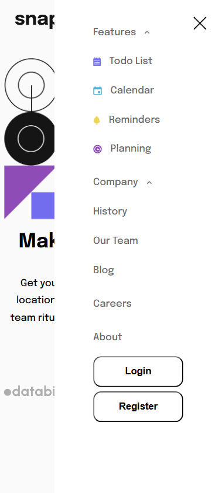

# Intro Section with Dropdown Navigation

A responsive frontend project that features a navigation bar with dropdown menus.  
Built with **HTML, CSS, and JavaScript**, optimized for both desktop and mobile devices.

## 🚀 Features

- Responsive design (mobile + desktop)
- Dropdown navigation menus
- Mobile hamburger menu
- Interactive states
- Clean and minimal UI

## 📷 Screenshots

### Desktop


### Mobile


### Active States


### Mobile Menu Expanded



## 🛠️ Built With

- **HTML5**
- **CSS3**
- **JavaScript (Vanilla)**

## 📦 Getting Started

1. Clone the repository:
   ```bash
   git clone https://github.com/Shin778/intro-section-with-dropdown-navigation.git
   ```
